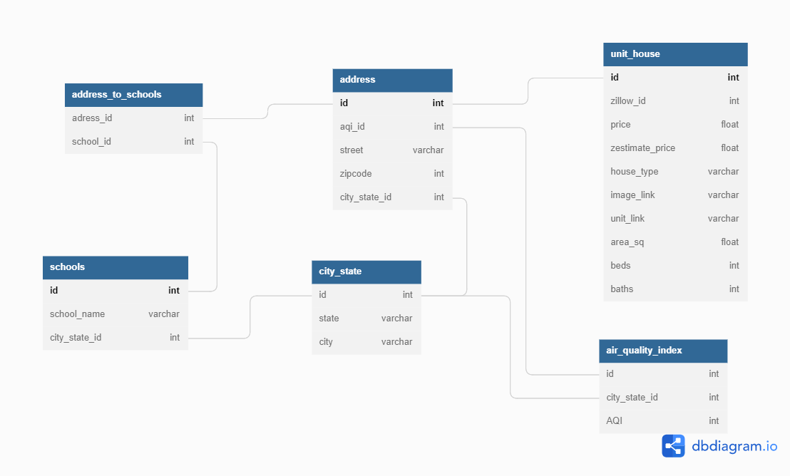

# Data mining project based on Zillow


[](https://s.zillowstatic.com/pfs/static/footer-art.svg)

✨- _link of this project: https://github.com/NoyAmram/Zillow_

Zillow is an American tech real-estate marketplace company. In their website www.zillow.com it lists information of different types of real-estate properties such as houses, apartments, villas, to rent and to buy. In addition, Zillow also has their own tool 'Zestimate' to estimate the value of real-estate properties. 


## What data is scraped? 

- Prices of real-estate properties in USA
- Size of the properties: quantity of bedrooms, bathrooms and total area. 
- Addresses of the properties 
- Links of the properties
- Additional information is added by using two free APIs:
  - [College Scorecard](https://collegescorecard.ed.gov/) for Schools per city per state
  - [IQAir](https://www.iqair.com/) for Air Quality Index per city per state

## Prerequisites: 
- Project requires [Python](https://www.python.org/) v3.7+ to run.
- MySQL v8.0+ for database. 
- API keys (free with registrasion)

## Installation:
- Clone the repo:   
 ```git clone https://github.com/NoyAmram/Zillow ```
- Use requirements.txt to install relevant packages.
- Enter your MySQL username and password in zillow_config.py under 'SQL_ROOT' and 'SQL_PASS'. 
- Enter your API keys in zillow_config.py under 'SCHOOLS_API_KEY' and 'AQI_API_KEY'. 
- Run the script empty_database.py to create an empty database with relevant tables for 'zillow'.
- Run zillow_main.py to scrape the data from the website and save the data into database 'zillow'.


## How did we scrape the data? 

Data scraping is done by using python package BeautifulSoup, Requests. 
Different input of search query can be entered by the user. 
Available parameters are city, state, number of pages to scrape. 
- Example of query: New-York NY 5
- Default values for query, if no arguments are given: San-Diego CA 20

## Database
Database containing 5 tables, below is an ERD visualization:


schema of the tables are shown below:
```markdown
+--------------+-----------------+----------------------+---------------------------+
| TABLE_SCHEMA | TABLE_NAME      | COLUMN_NAME          | CONSTRAINT_NAME           |
+--------------+-----------------+----------------------+---------------------------+
| zillow       | unit_address    | id                   | unit_address_ibfk_1       |
| zillow       | unit_image      | id                   | unit_image_ibfk_1         |
| zillow       | unit_info       | id                   | unit_info_ibfk_1          |
| zillow       | unit_link       | id                   | unit_link_ibfk_1          |
```


### Contributing
Contributions are what make the open source community such an amazing place to learn, inspire, and create. Any contributions you make are greatly appreciated.

If you have a suggestion that would make this better, please fork the repo and create a pull request. 

**Fork the Project**
1. Create your Feature Branch (```git checkout -b feature/AmazingFeature```)
2. Commit your Changes (```git commit -m 'Add some AmazingFeature'```)
3. Push to the Branch (```git push origin feature/AmazingFeature```)
4. Open a Pull Request


### Contact
Noy Amram: noy.amram@gmail.com
Project Link: https://github.com/NoyAmram/Zillow
